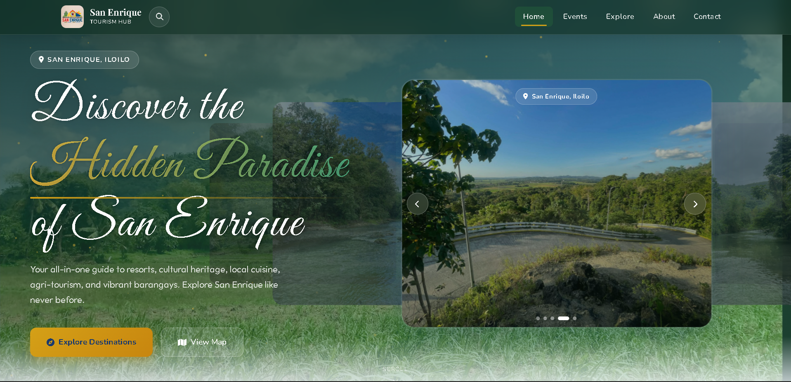

<p align="center">
  
</p>

<h1 align="center">San Enrique Tourism</h1>

<p align="center">
  A tourism and local business directory website for the Municipality of San Enrique, Iloilo, Philippines.<br>
  Built with PHP and MySQL to showcase resorts, cultural sites, food spots, farms, and community events.
</p>

<p align="center">
  
  
  
</p>

---

## About

San Enrique Tourism is a public-facing website paired with an admin panel, built for the Local Government Unit (LGU) of San Enrique to promote local tourism. Visitors can browse listings by category, view upcoming community events, explore locations on an interactive map, and leave reviews — while LGU staff manage everything through a dedicated admin dashboard.

## Features

**Public Site**
- 🏖️ Browse tourism listings by category (Resorts, Barangays, Cultural Sites, Food & Restaurants, Agri-Tourism & Farms, Nature & Adventure)
- 🔍 Search and filter listings
- 🗺️ Interactive map view of all locations (Google Maps)
- 📅 Upcoming community events, with pinned/featured events
- ⭐ Visitor reviews and ratings per listing
- 📩 Contact / inquiry form
- 📱 Responsive design for mobile and desktop

**Admin Panel**
- 🔐 Secure admin login with role support
- 📝 Full CRUD for listings, categories, and events
- 🖼️ Multi-image galleries per listing/event (local upload or Google Drive / direct URL links)
- 💬 Review moderation
- ✉️ Inbox for visitor messages
- 👥 Admin account management
- ⚙️ Site settings

## Tech Stack

- **Backend:** PHP (vanilla, mysqli)
- **Database:** MySQL / MariaDB
- **Frontend:** HTML, CSS, JavaScript, Bootstrap
- **Maps:** Google Maps API
- **Icons:** Font Awesome

## Project Structure

```
San Enrique/
├── admin/              # Admin panel (dashboard, listings, events, reviews, messages, settings)
├── api/                 # AJAX/API endpoints (search, contact, reviews, content)
├── assets/              # CSS, JS, and images
├── includes/            # Shared PHP (db connection, auth, helper functions)
├── uploads/              # User-uploaded listing/event images
├── database.sql          # Database schema + seed data
├── index.php             # Homepage
├── explore.php           # Listings directory / search
├── listing.php           # Single listing detail page
└── map.php               # Interactive map view
```

## Getting Started

### Requirements
- PHP 7.4+ (with `mysqli` extension enabled)
- MySQL or MariaDB
- A local server environment such as [XAMPP](https://www.apachefriends.org/), [WAMP](https://www.wampserver.com/), or [Laragon](https://laragon.org/)

### Installation

1. **Clone the repository** into your server's web root (e.g. `htdocs` for XAMPP):
   ```bash
   git clone https://github.com/<your-username>/<your-repo>.git
   ```

2. **Create the database**
   - Open phpMyAdmin (or your MySQL client)
   - Create a database named `san_enrique_tourism`
   - Import `database.sql` into it

3. **Configure the database connection**
   Open `includes/db.php` and update the credentials if needed:
   ```php
   define('DB_HOST', 'localhost');
   define('DB_USER', 'root');
   define('DB_PASS', '');
   define('DB_NAME', 'san_enrique_tourism');
   define('GOOGLE_MAPS_API_KEY', 'your-google-maps-api-key');
   ```
   > 🔑 Get a Google Maps API key from the [Google Cloud Console](https://console.cloud.google.com/google/maps-apis) and swap in your own — don't reuse a key committed to a public repo.

4. **Set folder permissions** so uploads work:
   ```bash
   chmod -R 755 uploads/
   ```

5. **Run it**
   Visit `http://localhost/<your-repo>/` in your browser.

### Default Admin Login

| Field    | Value                        |
|----------|-------------------------------|
| URL      | `/admin/login.php`             |
| Username | `admin`                        |
| Password | `Admin@123`                    |

> ⚠️ **Change this password immediately after first login** — it ships with the seed data and should never be used in production as-is.

## Screenshots

_Add a few screenshots of the homepage, listing page, and admin dashboard here once deployed, e.g.:_

```md


```

## Contributing

Issues and pull requests are welcome. For major changes, please open an issue first to discuss what you'd like to change.

## License

This project currently has no license specified. Add a `LICENSE` file if you intend to open source it, or note that it's proprietary to the LGU of San Enrique.

---

<p align="center">Made for the Municipality of San Enrique, Iloilo 🇵🇭</p>
